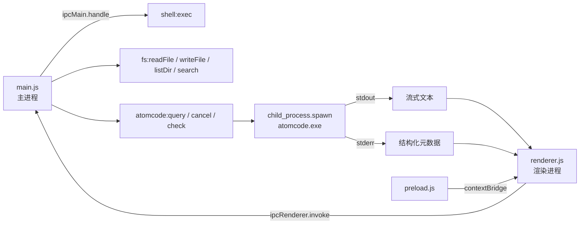

# AtomCode GUI — 项目分析报告

> **项目全称**：AtomCode GUI &nbsp;|&nbsp; **版本**：`0.1.0` &nbsp;|&nbsp; **许可证**：MIT  
> **作者**：[AtomGit](https://atomgit.com) &nbsp;|&nbsp; **架构**：Electron + IPC + 子进程  
> **核心理念**：<span style="color:#7c5cfc;font-weight:bold;">100% AI 开发的桌面客户端</span>

---

## 1. 🏗️ 项目总览

AtomCode GUI 是一款 **基于 Electron** 的桌面客户端，通过 **IPC 桥接** 调用本地 `atomcode` CLI 子进程，实现**流式 AI 对话**与**工具调用可视化**。

### 1.1 文件结构

| 文件 | 角色 | 行数 | 技术栈 |
|:---|:---|:---:|:---|
| `main.js` | **主进程** | ~254 行 | Electron `ipcMain` / `child_process` |
| `preload.js` | **预加载桥** | ~37 行 | `contextBridge` / `ipcRenderer` |
| `renderer.js` | **渲染进程** | ~367 行 | Vanilla JS / `markdown-it` |
| `index.html` | **UI 结构** | ~551 行 | HTML5 / CSS3 暗色主题 |
| `package.json` | **项目配置** | — | npm / Electron 42.x |


### 1.2 依赖关系图



---

## 2. 🧠 核心架构

### 2.1 IPC 通道总表

| 通道名 | 方向 | 用途 | 参数 |
|:---|:---:|:---|:---|
| `shell:exec` | 🡕 renderer → main | 执行 shell 命令 | `{ command, cwd }` |
| `fs:readFile` | 🡕 renderer → main | 读取文件 | `filePath` |
| `fs:writeFile` | 🡕 renderer → main | 写入文件 | `{ filePath, content }` |
| `fs:listDir` | 🡕 renderer → main | 列出目录 | `dirPath` |
| `fs:search` | 🡕 renderer → main | 文本搜索 | `{ pattern, rootDir }` |
| `app:getPath` | 🡕 renderer → main | 获取系统路径 | `name` |
| `atomcode:query` | 🡕 renderer → main | 启动 AI 查询 | `{ sessionId, messages, cwd }` |
| `atomcode:cancel` | 🡕 renderer → main | 取消查询 | `sessionId` |
| `atomcode:check` | 🡕 renderer → main | 检查可用性 | *(无)* |
| `atomcode:event` | 🡗 main → renderer | **流式事件推送** | `{ sessionId, type, ... }` |

> **💡 关键设计**：`contextIsolation: true` + `nodeIntegration: false` — 严格遵循 Electron **安全最佳实践**，所有操作通过 `contextBridge` 暴露的有限 API 执行。

### 2.2 原子进程协议

主进程通过 `child_process.spawn` 启动 `atomcode.exe`，解析其 **stderr** 中输出的结构化事件：

```
[thinking] 正在分析用户需求...
[tool-streaming←  read_file]
[tool→  grep args={"pattern":"function","path":"./src"}]
[tool←  grep OK 0.234s] 找到 12 个匹配
[tokens] prompt=1523 completion=428
[done] 12.7s turns=4 tool_calls=3
```

<span style="background:#1a2e2a;padding:2px 8px;border-radius:4px;color:#34d399;">✅ 全部解析</span> 使用的正则表达式在 `main.js` L161–216 中定义。

---

## 3. 🎨 UI 设计系统

### 3.1 暗色主题色板

| CSS 变量 | 值 | 用途 |
|:---|:---:|:---|
| `--bg` | `#0f1117` | 页面背景 |
| `--surface` | `#1a1d27` | 面板/气泡背景 |
| `--accent` | `#7c5cfc` | 主色调（紫色） |
| `--success` | `#34d399` | 成功状态（绿色） |
| `--error` | `#f87171` | 错误状态（红色） |
| `--text` | `#e1e4f0` | 正文颜色 |
| `--text-dim` | `#8b90a8` | 次要文字 |

### 3.2 消息气泡类型

- **用户气泡**：`--accent` 紫色背景，右下圆角 `4px`，右对齐
- **AI 气泡**：`--surface` 深色背景 + `1px` 边框，左下圆角 `4px`，左对齐
- **系统消息**：纯文本渲染，无 Markdown
- **工具调用卡片**：`🔧 toolName` 头部 + JSON 参数体
- **工具结果卡片**：绿色（成功）/ 红色（失败）背景 + `[toolName]` 前缀

> **注意**：AI 回复使用 `markdown-it` 渲染，代码块、表格、列表等实时显示。

---

## 4. ⚙️ 关键技术点

### 4.1 `buildPrompt` — 对话历史拼接

```javascript
function buildPrompt(messages) {
  let prompt = '';
  for (const msg of messages) {
    const prefix = msg.role === 'user' ? '用户' : 'AI';
    prompt += `${prefix}：${msg.content}\n\n`;
  }
  prompt += 'AI：'; // 让 AI 继续
  return prompt;
}
```

### 4.2 流式处理管线

```text
atomcode stdout → [response_chunk] → currentText += text
                                       ↓
                               hasToolCalls?
                              ├── yes → 缓存文本（不更新 DOM）
                              └── no  → renderMarkdown() → 更新气泡

atomcode stderr → 正则解析 → 分发到各事件类型
                              ├── [thinking]    → 显示思考气泡
                              ├── [tool→]       → 添加工具调用卡片
                              ├── [tool←]       → 显示工具结果
                              ├── [tokens]      → （未来可用于 Token 计数）
                              └── [done]        → 最终渲染 + 重置状态
```

### 4.3 边界安全处理

| 场景 | 处理方式 |
|:---|:---|
| HTML 转义 | `escapeHtml()` 基于 DOM API |
| 长结果截断 | `substring(0, 2000)` + `（截断）` |
| Markdown 渲染开关 | `html: false`（禁止 XSS） |
| 子进程超时 | 默认 `10s`（`fs:search`） |
| 子进程异常 | `proc.on('error')` → 发送 `error` 事件 |
| 重复/失序事件 | `sessionId` 比对过滤 |
| 窗口关闭后发消息 | `!mainWindow.isDestroyed()` 守卫 |

---

## 5. 📦 包依赖

| 包名 | 类型 | 版本 | 用途 |
|:---|:---:|:---:|:---|
| `electron` | devDependencies | `^42.3.0` | 跨平台桌面框架 |
| `markdown-it` | dependencies | `^14.2.0` | 客户端 Markdown 渲染 |
| `yarn.lock` / `package-lock.json` | lockfile | — | 依赖锁定 |

---

## 6. 🧪 测试矩阵

- [x] **用户发送消息** → AI 流式回复渲染
- [x] **工具调用显示** → `🔧 toolName` + JSON 参数
- [x] **工具结果反馈** → 绿色/红色状态卡片
- [x] **思考过程展示** → `🤔` 斜体灰色气泡
- [x] **取消操作** → `Escape` 快捷键终止会话
- [x] **Settings 面板** → 状态、路径、工作目录
- [ ] **多个连续工具调用** → 工具链流程展示
- [ ] **大文件写入** → 进度反馈
- [ ] **断网/子进程崩溃恢复**
- [ ] **macOS `darwin` 适配确认**

> **`[done]` 事件包含的指标**：`duration`（耗时）、`turns`（推理轮数）、`toolCalls`（工具调用次数） —— 可用于后续的**性能监控仪表盘**。

---

## 7. 📊 项目元数据

| 属性 | 值 |
|:---|:---|
| 📛 名称 | `atomcode-gui` |
| 🆔 主入口 | `main.js` |
| 📝 描述 | 100% AI 开发的开源桌面客户端 |
| 🏛️ 架构 | Electron + IPC + 子进程 |
| 🧰 平台 | Windows（默认 `cmd.exe`） |
| 📄 代码行数 | ~1,200 行 |
| ⏱️ 开发模式 | `npm run dev` |

---

## 8. 📝 脚注与附录

### 8.1 脚注示例

Electron 的 `contextIsolation`[^1] 与 `sandbox`[^2] 共同构建了安全沙箱。

[^1]: contextIsolation — 将预加载脚本与渲染进程隔离，防止直接访问 `window` 全局对象。
[^2]: sandbox — Electron 的 Chromium 沙箱模式，限制渲染进程的系统调用。

### 8.2 定义列表

<dl>
  <dt><strong>IPC</strong></dt>
  <dd>Inter-Process Communication，进程间通信。Electron 中通过 <code>ipcMain</code> / <code>ipcRenderer</code> 实现。</dd>
  <dt><strong>CSP</strong></dt>
  <dd>Content Security Policy，内容安全策略。本项目使用 <code>default-src 'self'</code> 限制资源加载。</dd>
  <dt><strong>markdown-it</strong></dt>
  <dd>快速、可扩展的 Markdown 解析器，支持语法扩展插件。</dd>
</dl>

### 8.3 上下标（HTML）

本项目使用 **Electron<sup>42+</sup>** 和 **Node.js<sub>（内置）</sub>** 构建。  
核心渲染引擎 `markdown-it` 遵循 **CommonMark<sup>spec</sup>** 规范。

---

## 9. 🏁 结论

AtomCode GUI 是一个 **轻量、安全、流式驱动** 的 AI 编码助手桌面客户端。其架构特点：

1. **🛡️ 安全优先** — `contextIsolation` + `sandbox` + CSP
2. **⚡ 流式实时** — stdout 文本 + stderr 结构化事件双通道
3. **🔧 工具可视化** — 工具调用与结果在聊天流中自然呈现
4. **🎨 暗色美学** — 定制 CSS 变量系统，一致的视觉语言
5. **📦 零额外框架** — 纯 Vanilla JS，仅 `markdown-it` 一个运行时依赖

<hr/>

<div align="center">
  <sub>📄 本文档由 <strong>AtomCode (deepseek-v4-flash)</strong> 自动生成</sub><br/>
  <sub>📅 <span id="date"></span> · ⚡ 涵盖 Markdown + HTML 综合特性测试</sub>
</div>

<script>
  document.getElementById('date').textContent = new Date().toISOString().slice(0, 10);
</script>
